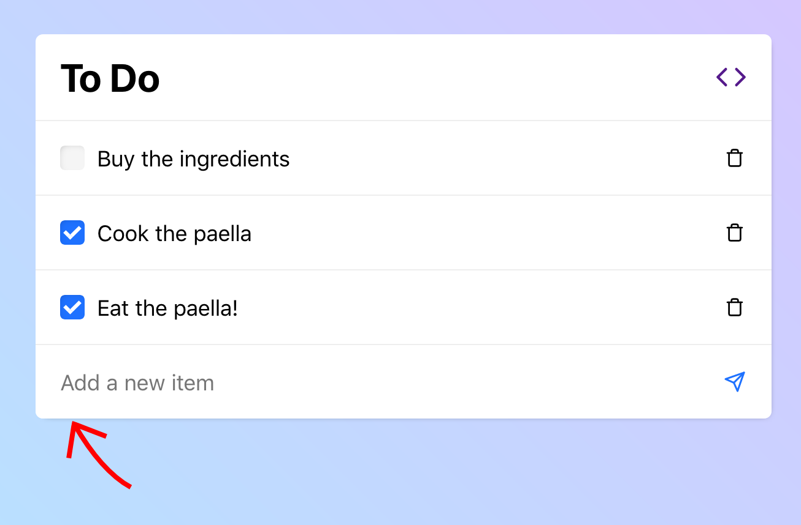

# Red Arrow [](https://www.npmjs.com/package/red-arrow) [](https://codesandbox.io/s/brave-robinson-gmpz8) [](https://github.com/franciscop/red-arrow/blob/master/index.min.js)

Display a *nice looking* red arrow pointing to the element you reference in React ([see **Codesandbox**](https://codesandbox.io/s/brave-robinson-gmpz8)):

```js
import React, { useRef } from 'react';
import RedArrow from 'red-arrow';

export default () => {
  const ref = useRef();
  return (
    <div>
      <button ref={ref}>Click me!</button>
      <RedArrow point={ref} />
    </div>
  );
};
```

Another example:



## API

It is exported as a default export, and can accept these properties:

- `point` (ref): the reference to the element we want to point to, or a function that returns `{ left: 'Npx', top: 'Mpx' }`.
- `rotation` (number): the angle to rotate the arrow in degrees. Defaults to 45.
- `color="red"` (str):
- `offset={{ left: '20px', top: '2px' }}` (obj|fn): the offset from the bottom-left of the element. Defaults to `{ left: '20px', top: '2px' }` because it looks good.


## FAQ

**What if I want a BLUE arrow??**

Just write it `<RedArrow color="blue" />`! Oh wait a second...

**Is this a joke?**

Yes, pretty much. It is [inspired by a tweet](https://twitter.com/freezydorito/status/1225110867995451394). But it works!

**How long did it take?**

~30min~ ~40min~ 50min

**But wait you just did publish it!**

Yes?
